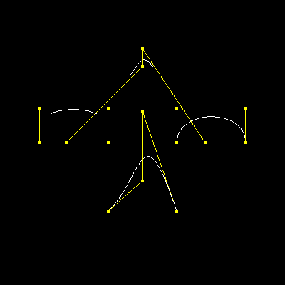
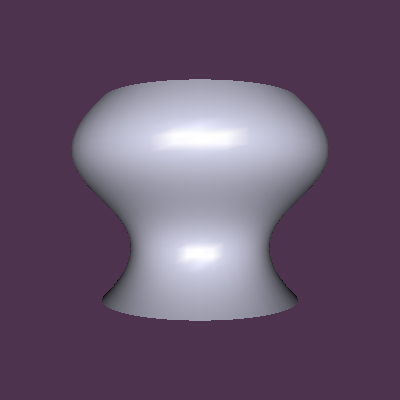
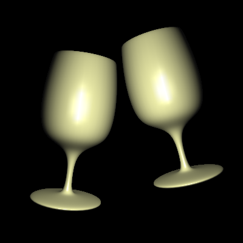

### PA2

#### Run

```bash
bash ./run_all.sh
```

#### Result

| 1                              | 2                                                   | 3                                                   |
| ------------------------------ | --------------------------------------------------- | --------------------------------------------------- |
|  |  |  |

#### Structure
```txt
├─assets
├─build
│  ├─CMakeFiles
│  │  ├─3.22.1
│  │  │  └─CompilerIdCXX
│  │  │      └─tmp
│  │  ├─CMakeTmp
│  │  └─PA2.dir
│  │      └─src
│  └─deps
│      └─vecmath
│          └─CMakeFiles
│              └─vecmath.dir
│                  └─src
├─deps
│  ├─freeglut
│  │  ├─bin
│  │  │  └─x64
│  │  ├─include
│  │  │  └─GL
│  │  └─lib
│  │      └─x64
│  └─vecmath
│      ├─include
│      └─src
├─include
├─mesh
├─output
├─ref
├─src
├─testcases
└─test_opengl
```
