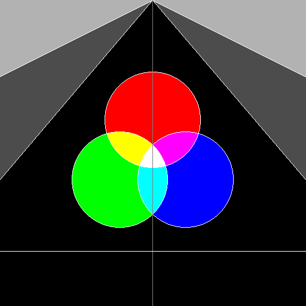

### PA0

#### Structure

```txt
├─assets
├─build
│  ├─CMakeFiles
│  │  ├─3.22.1
│  │  │  └─CompilerIdCXX
│  │  │      └─tmp
│  │  ├─CMakeTmp
│  │  └─PA0.dir
│  │      └─src
│  └─deps
│      └─vecmath
│          └─CMakeFiles
│              └─vecmath.dir
│                  └─src
├─code
│  └─include
├─deps
│  └─vecmath
│      ├─include
│      └─src
├─include
├─output
├─src
└─testcases
```

#### Run

- require: CMake

```bash
bash ./run_all .sh
```

#### Results

| 1                                                | 2                                |
| ------------------------------------------------ | -------------------------------- |
|  |  |

