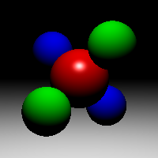
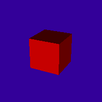
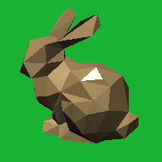
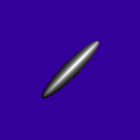
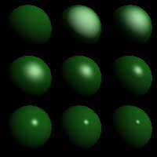
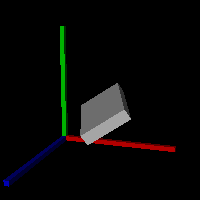
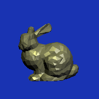
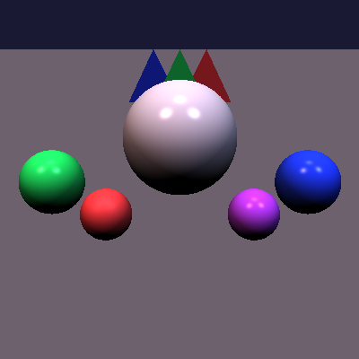

### PA1
#### Run
```bash
./run_all.sh
```
#### Output
|  |                               |  |                   |
| ---------------------------- | ----------------------------------------------------- | --------------------------------- | -------------------------------------------------------- |
|    |  |   |  |

#### Structure
```txt
.
├── CMakeLists.txt
├── deps
│   └── vecmath
│       ├── CMakeLists.txt
│       ├── include
│       │   ├── Matrix2f.h
│       │   ├── Matrix3f.h
│       │   ├── Matrix4f.h
│       │   ├── Quat4f.h
│       │   ├── vecmath.h
│       │   ├── Vector2f.h
│       │   ├── Vector3f.h
│       │   └── Vector4f.h
│       └── src
│           ├── Matrix2f.cpp
│           ├── Matrix3f.cpp
│           ├── Matrix4f.cpp
│           ├── Quat4f.cpp
│           ├── Vector2f.cpp
│           ├── Vector3f.cpp
│           └── Vector4f.cpp
├── include
│   ├── camera.hpp
│   ├── group.hpp
│   ├── hit.hpp
│   ├── image.hpp
│   ├── light.hpp
│   ├── material.hpp
│   ├── mesh.hpp
│   ├── object3d.hpp
│   ├── plane.hpp
│   ├── ray.hpp
│   ├── scene_parser.hpp
│   ├── sphere.hpp
│   ├── transform.hpp
│   └── triangle.hpp
├── mesh
│   ├── bunny_1k.obj
│   ├── bunny_200.obj
│   └── cube.obj
├── run_all.sh
├── src
│   ├── image.cpp
│   ├── main.cpp
│   ├── mesh.cpp
│   └── scene_parser.cpp
└── testcases
    ├── scene01_basic.txt
    ├── scene02_cube.txt
    ├── scene03_sphere.txt
    ├── scene04_axes.txt
    ├── scene05_bunny_200.txt
    ├── scene06_bunny_1k.txt
    └── scene07_shine.txt
```