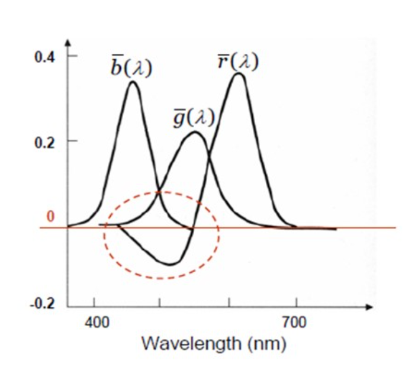
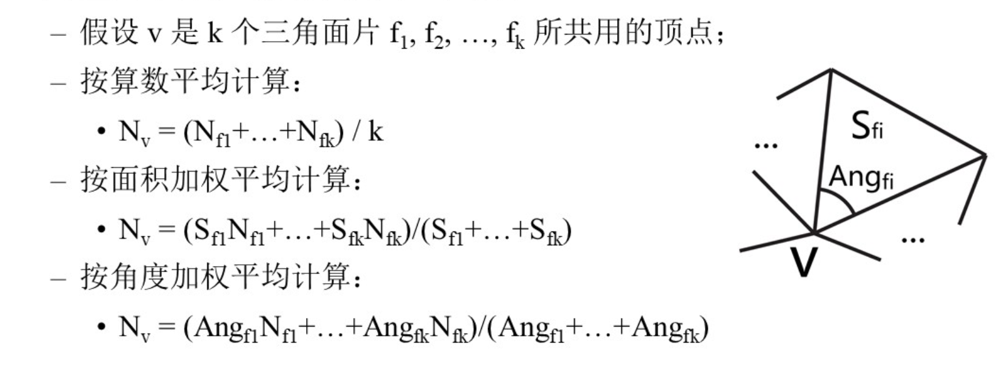
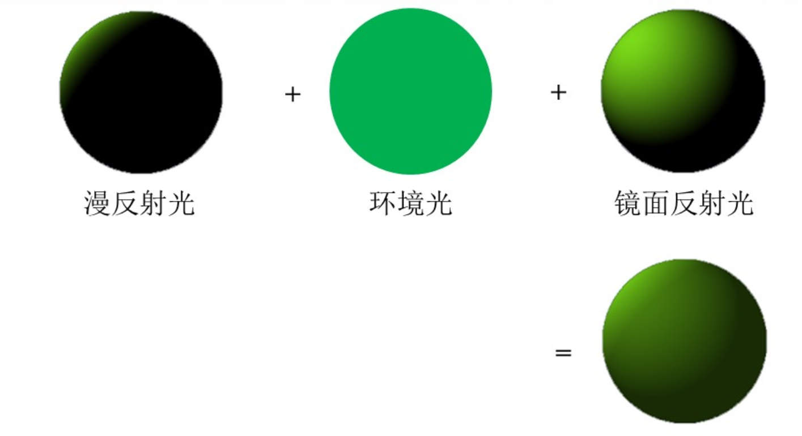
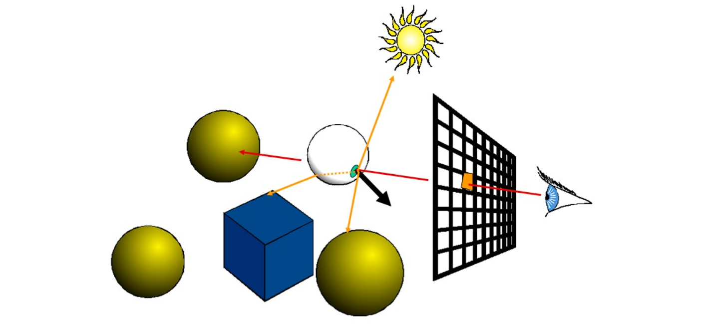

# 图形学 CG

> Notes Taking: 王子轩
>
> `wang-zx23@mails.tsinghua.edu.cn`
>
> Lecture Instructor: 胡事明

[TOC]

## 1 图形学基本概念

### 1.1 颜色视觉

人眼感知到的颜色由三个决定：照明条件（光源的谱分布），物体材质（物体的反射光谱），观察条件

几种常见的颜色空间：

**RGB:**$(R,G,B), rR+gG+bB$ 有负系数情况，通常归一化为$[0,1]$之间的float number,或$[0,255]$之间的8=bits无符号整数



**CMY:**分别用RGB的互补颜色，减色系统

**HSV：**常用于图像处理、艺术领域，（Hue色调，Saturation饱和度，Value of brightness亮度)

**CIE XYZ:**基于RGB的线性变换

### 1.2 图像与像素

- 二维场景：**pixel**，$f(x,y)$, eg: 四维（RGBA），$f:\mathbb{R}^2\rightarrow \mathbb{R}^4$ 

- 三维图形的表征：

​	顶点集合：$V = (v_1, \cdots, v_n)$

​	面片集合：$F = (f_1, \cdots f_m), \quad f_i = (v_{ai},v_{bi}, v_{ci})$

> 如何确定三角面片的法向：按照周围的面片的法向有不同的加权平均方式



### 1.3 光照与着色

- 光照模型

  - local lighting
  - global lighting
  - 光照模型的历史：bouknight ->Gouraund->Phong->Jimkajiya

- **Phong**光照模型

  Phong模型认为光照可以分解为环境光，漫反射光和镜面反射光

$$
I = I_a + I_d + I_s\\
I_a = k_a \cdot I_l\\
I_d = k_d \cdot \max\{(\mathbf{L} \cdot \mathbf{N})\} \cdot I_l\\
I_s = k_s \cdot \max\{0,(\mathbf{R} \cdot \mathbf{V})^n)\} \cdot I_l\\
\mathbf{R} = 2 \cdot (\mathbf{L} \cdot \mathbf{N}) \cdot \mathbf{N} - \mathbf{L}\\
I = k_a \cdot I_l + k_d \cdot (\mathbf{L} \cdot \mathbf{N}) \cdot I_l + k_s \cdot (\mathbf{R} \cdot \mathbf{V})^n \cdot I_l\\
$$



Phong模型常采用对法向进行插值的方式做平滑。

## 2 真实感渲染

### 2.1 BRDF(Bidirectional Reflectance Distribution Function)

- 对于给定的场景点 \( p \)，BRDF 是关于入射光方向和反射光方向的四维实值函数，它等于反射方向的光亮度和沿入射方向的入射光的辉度之比：
  $$
  f_r(\omega_i \rightarrow \omega_r) = \frac{\mathrm{d}L_r(\omega_r)}{\mathrm{d}E_i(\omega_i)}
  $$
  
- 可以写成关于入射光的光亮度的形式：
  $$
   f_r(\omega_i \rightarrow \omega_r) = \frac{\mathrm{d}L_r(\omega_r)}{\mathrm{d}E_i(\omega_i)} = \frac{\mathrm{d}L_r(\omega_r)}{L_i(\omega_i) \cos \theta_i \mathrm{d}\omega_i}
  $$
  

### 2.2 The Rendering Equation

描述物体表面的光线传播，相比于反射方程多一项自发项
$$
L_o(p, \omega_o) = L_e(p, \omega_o) + \int_{\Omega} L_i(p, \omega_i) f_r(p, \omega_i, \omega_r) (n \cdot \omega_i) \mathrm{d}\omega_i
$$

- 递归，$L_i$对应的是另外一个点的渲染方程.

## Ray Tracing

主要计算量：确定光线的可见点，对每一条光线，要检查它是否与场景中的物体相交（**Ray Intersection**）



```python 
IntersectColor(vBeginPoint, vDirection)
{
	Determine IntersectPoint # 这一步需要对场景中的物体光线求交
	Color = ambient color
	for each light
		Color += local shading term # 使用局部光照模型
		if surface is reflective:
			color += ReflectC * IntersectColor(IntersectPoint, Reflect Ray)
		if surface is refrative:
			color += RefractC * IntersectColor(IntersectPoint, Refract Ray)
	return color
}
```

- 光线用

$$
P(t) = R_o + tR_d
$$

- `Determine IntersectPoint`处理光线与平面、三角形、球形、正方体的交点

- 递归的深度：1递归最大深度 2. 当光线的贡献小于阈值 3. 光线射到场景外

蒙特卡洛光线追踪：

估计渲染方程

