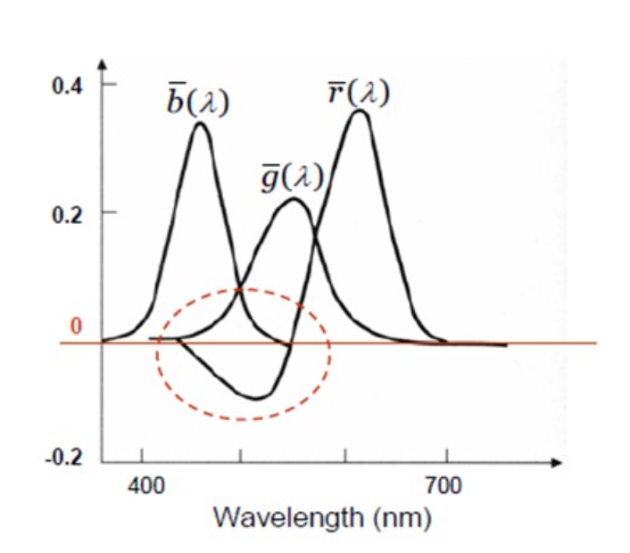
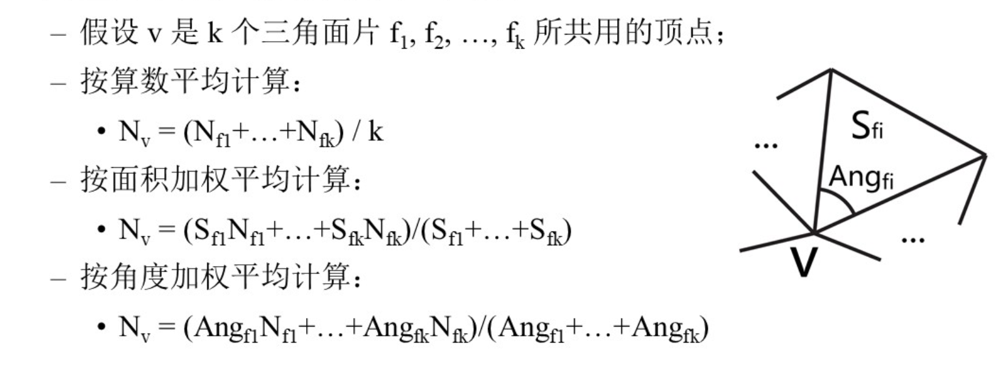
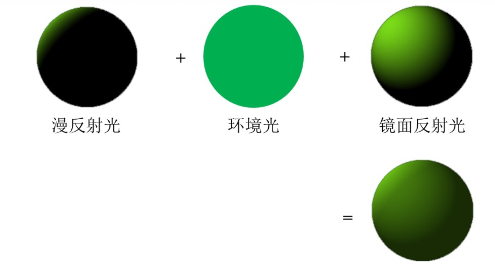
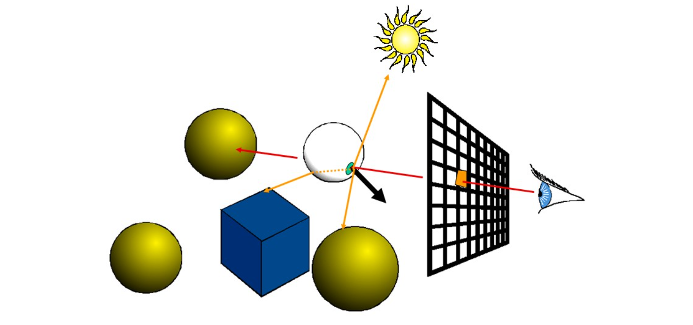

# Computer Graphics (CG)

> **Notes Taking:** Zixuan Wang (王子轩)
>
> **Email:** wang-zx23@mails.tsinghua.edu.cn
>
> **Lecture Instructor:** Shimin Hu (胡事民)

[TOC]

## Academic Integrity Policy

### Implementation Rules for Disciplinary Actions against Tsinghua University Students

**Chapter VI: Academic Misconduct and Violations of Learning Discipline**

Article 21 Students who commit any of the following serious violations of course learning discipline shall be given a punishment of warning or above, but not exceeding disciplinary probation:

1. Serious plagiarism in course assignments
2. Serious plagiarism in laboratory reports or falsification of experimental data
3. Serious plagiarism in midterm or final course papers
4. Other serious acts of deception during the course learning process

## Course Overview

This repository contains lecture notes, assignments, and resources for the Computer Graphics course at Tsinghua University. The course covers fundamental concepts in graphics programming, rendering techniques, and visual computing.

## Topics Covered

### 1. Basic Concepts of Computer Graphics

#### 1.1 Color Vision

The color perceived by the human eye is determined by three factors:
- Illumination conditions (spectral distribution of the light source)
- Object material (reflection spectrum of the object)
- Observation conditions

**Common Color Spaces:**

- **RGB:** $(R,G,B), rR+gG+bB$ - Has negative coefficient cases, typically normalized to float numbers in $[0,1]$ or 8-bit unsigned integers in $[0,255]$



- **CMY:** Uses complementary colors of RGB, subtractive color system
- **HSV:** Commonly used in image processing and art fields (Hue, Saturation, Value of brightness)
- **CIE XYZ:** Based on linear transformation of RGB

#### 1.2 Images and Pixels

- **2D Scenes:** **pixel**, $f(x,y)$, e.g., four-dimensional (RGBA), $f:\mathbb{R}^2\rightarrow \mathbb{R}^4$

- **3D Graphics Representation:**
  - Vertex set: $V = (v_1, \cdots, v_n)$
  - Face set: $F = (f_1, \cdots f_m), \quad f_i = (v_{ai},v_{bi}, v_{ci})$

> **How to determine the normal of triangular faces:** Different weighted averaging methods based on surrounding face normals



#### 1.3 Illumination and Shading

- **Lighting Models:**
  - Local lighting
  - Global lighting
  - History of lighting models: Bouknight → Gouraud → Phong → Jim Kajiya

- **Phong Illumination Model:**

  The Phong model decomposes lighting into ambient, diffuse, and specular components:

  $$
  I = I_a + I_d + I_s\\
  I_a = k_a \cdot I_l\\
  I_d = k_d \cdot \max\{(\mathbf{L} \cdot \mathbf{N})\} \cdot I_l\\
  I_s = k_s \cdot \max\{0,(\mathbf{R} \cdot \mathbf{V})^n)\} \cdot I_l\\
  \mathbf{R} = 2 \cdot (\mathbf{L} \cdot \mathbf{N}) \cdot \mathbf{N} - \mathbf{L}\\
  I = k_a \cdot I_l + k_d \cdot (\mathbf{L} \cdot \mathbf{N}) \cdot I_l + k_s \cdot (\mathbf{R} \cdot \mathbf{V})^n \cdot I_l\\
  $$



The Phong model commonly uses normal interpolation for smoothing.

### 2. Realistic Rendering

#### 2.1 BRDF (Bidirectional Reflectance Distribution Function)

- For a given scene point $p$, BRDF is a four-dimensional real-valued function of incident light direction and reflected light direction. It equals the ratio of reflected luminance to incident irradiance:

  $$
  f_r(\omega_i \rightarrow \omega_r) = \frac{\mathrm{d}L_r(\omega_r)}{\mathrm{d}E_i(\omega_i)}
  $$

- Can be written in terms of incident luminance:

  $$
   f_r(\omega_i \rightarrow \omega_r) = \frac{\mathrm{d}L_r(\omega_r)}{\mathrm{d}E_i(\omega_i)} = \frac{\mathrm{d}L_r(\omega_r)}{L_i(\omega_i) \cos \theta_i \mathrm{d}\omega_i}
  $$

#### 2.2 The Rendering Equation

Describes light propagation on object surfaces, with an additional emission term compared to the reflection equation:

$$
L_o(p, \omega_o) = L_e(p, \omega_o) + \int_{\Omega} L_i(p, \omega_i) f_r(p, \omega_i, \omega_r) (n \cdot \omega_i) \mathrm{d}\omega_i
$$

- Recursive: $L_i$ corresponds to the rendering equation at another point.

### Ray Tracing

**Main computation:** Determining visible points of rays. For each ray, we must check whether it intersects objects in the scene (**Ray Intersection**)



```python
IntersectColor(vBeginPoint, vDirection)
{
    Determine IntersectPoint  # This step requires ray intersection with scene objects
    Color = ambient color
    for each light
        Color += local shading term  # Use local illumination model
        if surface is reflective:
            color += ReflectC * IntersectColor(IntersectPoint, Reflect Ray)
        if surface is refractive:
            color += RefractC * IntersectColor(IntersectPoint, Refract Ray)
    return color
}
```

- **Ray representation:**

  $$
  P(t) = R_o + tR_d
  $$

- `Determine IntersectPoint` handles ray intersections with planes, triangles, spheres, and cubes

- **Recursion depth:**
  1. Maximum recursion depth
  2. When ray contribution is below threshold
  3. When ray exits scene

**Monte Carlo Ray Tracing:** Estimates the rendering equation

### Bounding Volume Calculation

Using triangular facet models for direct ray intersection leads to $\mathcal{O}(n)$ time complexity. Bounding boxes are used for pre-intersection testing with rays.

- **Bounding boxes:**

- **Implicit surface bounding box calculation:**
  - Since implicit representation is $F(x,y,z) = 0$, use Lagrange multipliers on $ax+by+cz = 0$ to find min and max values

- **Bounding sphere**


## Course Structure

- **Practical Assignments (PA):** Located in the `PA/` directory
- **Lecture Assets:** Images and supplementary materials in the `assets/` directory

## Getting Started

### Prerequisites

- C++ compiler supporting C++17 or later
- CMake 3.15 or higher
- (Add other dependencies as needed)

### Build Instructions

```bash
mkdir build
cd build
cmake ..
make
```

## Contributing

This is a course repository. For questions or suggestions, please contact the instructor or teaching assistants.

## License

Please refer to the course guidelines for usage and redistribution policies.

## Acknowledgments

- Course Instructor: Professor Shimin Hu
- Tsinghua University
- Department of Computer Science and Technology

---

**Note:** This repository is for educational purposes. Please adhere to academic integrity guidelines when using course materials.
